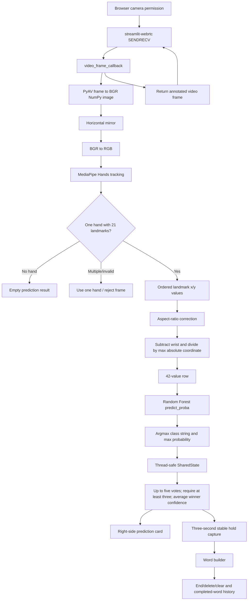

# Real-Time Sign-to-Text Converter: Technical Reference

**Audit date:** 2026-10-09  
**Purpose:** Factual source for independently writing an engineering report or research paper. This document is an audit, not a report or a paper. The current fix pass changed preprocessing reuse, model validation, temporal result handling, benchmark baseline methodology, tests, and the development-container Python image; it did not retrain or replace the model or change runtime dependencies/WebRTC settings.

## Evidence Labels

- **[Code]** Directly visible in the current source.
- **[Artifact]** Stored in a repository artifact such as a model, dataset, benchmark JSON, README, or Git metadata.
- **[Measured]** Observed by a command/test run during this audit.
- **[External]** Supported by a linked publication or official technical documentation.
- **[Inferred]** Plausible interpretation, not established by source or experiment.
- **[Unknown]** Not found or not tested.

## 1. Executive Summary

The project is a Python/Streamlit browser application that maps a single visible static hand pose to one character from digits `0–9` and lowercase letters `a–z`. The browser sends webcam frames over `streamlit-webrtc`; server-side MediaPipe Hands detects and tracks the hand; the application extracts a wrist-relative, scale-normalized 42-value vector from 21 ordered x/y landmarks; a persisted scikit-learn Random Forest emits a class and probability distribution; Streamlit displays the current class, confidence, capture progress, current word, and completed words. **[Code]**

The saved runtime model is `models/gesture_model.pkl`: `RandomForestClassifier`, 100 trees, 42 input features, 36 string labels, file size 16,375,897 bytes. **[Artifact/Measured]** Its benchmark JSON reports 95.8652% accuracy and macro F1 0.951759 on 653 rows, produced by a stratified row-level 80/20 split. That is not a user-independent or session-independent evaluation. **[Artifact]**

The project’s actual contribution is an integrated real-time prototype using browser video, hand landmarks, a compact tabular classifier, and character/word composition. No algorithmic novelty, full sign-language translation, user-independent generalization, or end-to-end performance result is established. **[Code/Artifact]**

**Preprocessing update:** training and inference now call the same `core.landmark_features.extract_landmarks` function and pass the source image shape. Existing training images are square, so the added width/height factor equals 1 and leaves their feature vectors unchanged. Live non-square video uses the same aspect-ratio correction. Unit tests verify square parity and the non-square formula; full re-extraction/retraining was not performed. **[Code/Measured]**

**Current repository condition:** `main` is at `eab7a818` and matches `origin/main` at the start of this fix pass. The working tree now contains uncommitted changes to shared preprocessing, model validation, temporal stability, benchmark methodology, the Python 3.12 devcontainer, benchmark/report artifacts, tests, and this reference. The current Streamlit Cloud deployment commit remains unavailable for verification. **[Measured]**

## 2. Project Identity, Problem, Scope, and Contribution

### 2.1 Names

| Name | Evidence | Status |
|---|---|---|
| Hand Gesture Recognition System | README title and `APP_TITLE` uses “Sign Language to Text Converter” | Two names are used; a single canonical academic title is not established. |
| Sign Language to Text Converter | `config/settings.py`, app browser title | Current UI title. |
| Real-Time Sign-to-Text Converter | User-provided project description | Requested descriptive name; not the exact repository README title. |

### 2.2 Problem and Intended Use

- **[Code]** Input is one browser video stream. Output is a sequence of predicted isolated characters from 36 labels.
- **[Inferred]** Intended for a demo or assistive communication prototype in which a user spells text by presenting static hand poses.
- **[Unknown]** The repository does not specify a validated target user group, a sign-language variant, an accessibility study, or a clinical/educational deployment context.
- **Important boundary:** the implemented model recognizes single-frame character-like gestures. It does not translate continuous sign-language video, recognize words/grammar, infer sentence semantics, or model motion-dependent signs. The word builder concatenates character predictions; it is not linguistic translation.

### 2.3 Objectives Evidenced by Code

1. Capture webcam video in a browser and receive frames on the server.
2. Detect one hand with MediaPipe Hands and draw 21 landmarks/connections.
3. Convert landmarks to 42 features and classify them into digits/letters.
4. Display a live prediction and confidence and support user text composition.
5. Run as a Streamlit application, including Community Cloud configuration.

These are implementation objectives. Their existence does not demonstrate reliability across users, cameras, lighting, or networks.

### 2.4 Implemented / Partial / Missing

| Capability | Status based on current code/evidence |
|---|---|
| Browser camera via WebRTC | Implemented in code; user previously reported deployed video working. Current Cloud state is not independently verifiable from repository. |
| One-hand tracking and landmark overlay | Implemented; `MEDIAPIPE_MAX_HANDS=1`. A multi-hand status branch exists but normally cannot be reached when MediaPipe honors that limit. |
| 36-way static character classifier | Implemented; saved model has 36 string classes. |
| Confidence display | Implemented using maximum `predict_proba` value; this is an uncalibrated tree vote fraction, not validated probability calibration. |
| Temporal smoothing | Implemented over five results; the current fix requires at least 3 votes for a stable prediction and averages confidence only over votes for that winning label. |
| Automatic character capture | Implemented after 3 seconds of a stable prediction, followed by 1 second cooldown. |
| No-hand auto-completion | Implemented: after 8 seconds without a hand, a nonempty word is completed. |
| Manual add, end word, delete, clear | Implemented as Streamlit buttons and pure helpers in `core/text_state.py`. |
| Completed-word history | Implemented in session state and displayed as a ` | `-joined string. It is not persistent storage. |
| Continuous sign-language sentence translation | Not implemented. |
| Speech synthesis/output | Not found. |
| User/session identification and grouped test | Not implemented; dataset has no group metadata. |
| Robustness study across conditions/users | Not found. |
| App-level FPS or end-to-end latency measurement | Not measured. |

## 3. Repository Structure and File-by-File Audit

### 3.1 Relevant Tree

```text
.
├── .devcontainer/devcontainer.json
├── .gitignore
├── .gitattributes
├── .python-version
├── .streamlit/config.toml
├── app.py
├── BENCHMARK_REPORT.md
├── benchmark_results.json
├── config/
│   ├── __init__.py
│   └── settings.py
├── core/
│   ├── __init__.py
│   ├── hand_processor.py
│   ├── landmark_features.py
│   ├── model_manager.py
│   ├── prediction_smoothing.py
│   └── text_state.py
├── dataset/alphabets/{0..9,a..z}/       [local, ignored by Git]
├── landmark_dataset.csv                 [local, ignored by Git]
├── models/
│   ├── alphabet_model.pkl
│   └── gesture_model.pkl
├── packages.txt
├── README.md
├── requirements.txt
├── requirements-dev.txt
├── runtime.txt
├── tests/test_core.py
├── tools/
│   ├── benchmark.py
│   ├── collect_alphabets_data.py
│   ├── extract_alphabets_landmarks.py
│   └── train_alphabet_model.py
├── ipconfig_full.txt                    [tracked; contains local network configuration; contents intentionally not reproduced]
└── temporary project deeds.docx         [tracked; content not read: python-docx is unavailable]
```

`.venv`, `.git`, bytecode, and pytest caches are excluded above as environment/generated data. The dataset and CSV are ignored locally; Git does not include them. The model files, benchmark outputs, and `temporary project deeds.docx` are tracked. `ipconfig_full.txt` is tracked even though `.gitignore` lists that name; do not publish its contents without a privacy review. **[Measured]**

### 3.2 File Audit

| File/folder | Purpose and important symbols | Inputs → outputs | Relevance/status |
|---|---|---|---|
| `app.py` | Streamlit entry point; `SharedState`, `get_ice_servers`, `video_frame_callback`, `webrtc_streamer`, `render_live_status` | Browser frames/results/session actions → rendered camera, prediction, word/history UI | Main application control flow. Lines 27–160 initialize state and shared thread-safe data; 307–338 load resources/callback; 341–408 camera/UI/actions; 445 onward status/capture fragment. |
| `core/hand_processor.py` | `create_hands_detector`, imported `extract_landmarks`, `process_frame` | BGR frame + MediaPipe detector + model → annotated frame and result dictionary | Owns CV and prediction path; delegates features to shared helper. |
| `core/landmark_features.py` | `extract_landmarks` | MediaPipe landmark object + optional image shape → float64 `(1,42)` feature row | Canonical training/live preprocessing function. |
| `core/model_manager.py` | `model_contract_error`, `load_model`, cached by `st.cache_resource` | serialized model → validates 42 features, ordered 36 labels, and `predict_proba` support; returns classifier or `None` | Runtime loading and artifact compatibility guard. |
| `core/prediction_smoothing.py` | `stable_prediction` | up to five `(label, confidence)` items and minimum votes → stable label and matching-label mean confidence | Pure tested temporal aggregation helper. |
| `core/text_state.py` | `add_letter`, `delete_letter`, `complete_word`, `clear_text` | word/history values → immutable/new text state | Pure word/history operations. Lines 1–18. |
| `config/settings.py` | model/data paths, MediaPipe and capture constants, STUN/TURN secret-key names, UI labels | constants → imported app/core configuration | Central config. Lines 1–42. |
| `tools/collect_alphabets_data.py` | OpenCV webcam capture loop | prompted class + local webcam → crop images under `dataset/alphabets/<class>` | Intended data-collection workflow, not public-cloud runtime. Lines 1–39. |
| `tools/extract_alphabets_landmarks.py` | static MediaPipe extraction | image class folders → `landmark_dataset.csv` | Produces training table. Lines 1–54. |
| `tools/train_alphabet_model.py` | split, fit RF, score, joblib save | landmark CSV → `models/gesture_model.pkl` | Training procedure. Lines 1–35. |
| `tools/benchmark.py` | `run_benchmark`, `measure_predictions`, report writer | CSV + model → JSON metrics/report | Offline classifier benchmark; no webcam/MediaPipe timing. Lines 21–229. |
| `tests/test_core.py` | eight unit tests | synthetic point/detector/model fixtures plus saved model → assertions | Feature parity, text operations, model contract, and temporal stability. |
| `models/gesture_model.pkl` | active deployed classifier | `(1,42)` numeric input → 36 string-label probabilities | Loaded through `config/settings.py` and `core/model_manager.py`. 16,375,897 bytes. |
| `models/alphabet_model.pkl` | additional serialized classifier | model artifact | 49,071,177 bytes, 300 trees, 42 features, 36 classes when loaded locally; no active source reference found. Origin/purpose is not documented. |
| `landmark_dataset.csv` | local landmark dataset | numeric columns 0–41 plus `label` | 3,263 rows, 42 features; ignored by Git, so absent from clean clone unless separately supplied. |
| `dataset/alphabets/` | local image samples by label | image files | 4,868 images; ignored by Git. |
| `benchmark_results.json` | machine-readable benchmark output | benchmark command → stored scores/timing/confusions | Regenerated with the current canonical five-repeat benchmark. |
| `BENCHMARK_REPORT.md` | narrative result/method/limitations | benchmark run → report | Synchronized with the current JSON and corrected train-only baseline methodology. |
| `requirements.txt` | runtime Python dependencies | pip → Cloud/local runtime packages | Pinned packages; see stack section. |
| `requirements-dev.txt` | development additions | pip → pandas and pytest in addition to runtime requirements | Contains `-r requirements.txt`, `pandas==2.2.2`, `pytest==8.3.5`. |
| `packages.txt` | apt packages for Linux deployment | Cloud build → `libgl1`, `libglib2.0-0` | Present; whether each is still strictly necessary was not experimentally tested on Cloud. |
| `.python-version`, `runtime.txt` | Python selection hints | hosting/tooling → Python 3.12 target | Both specify 3.12. |
| `.streamlit/config.toml` | theme, server/browser settings | Streamlit → UI/security configuration | XSRF/CORS enabled; no secrets are stored here. |
| `.devcontainer/devcontainer.json` | development container | devcontainer → Python 3.12 Bookworm image | Aligned with Python 3.12 deployment target by this fix pass. |
| `.gitignore` | excludes local env/data/secrets | Git → ignored paths | Excludes dataset/CSV, `.venv`, and `.streamlit/secrets.toml`; an already tracked `ipconfig_full.txt` remains tracked despite an ignore entry. |
| `README.md` | setup, feature, training, deployment, benchmark documentation | human reader | Useful but does not provide a verified public URL or full model/dataset provenance. |
| `temporary project deeds.docx` | unknown project document | unknown | Tracked. Not parsed because `python-docx` is not installed; contents must be checked manually. |
| `ipconfig_full.txt` | unknown network diagnostic dump | unknown | Tracked, privacy-sensitive local-network information; values intentionally not displayed. |
| `config/__init__.py`, `core/__init__.py` | package markers | Python import system | No additional implementation found. |

## 4. Architecture and End-to-End Data Flow

### 4.1 Verified Flow

```text
Browser (HTTPS) and camera permission
  → streamlit-webrtc component, key="gesture-detection", SENDRECV
  → video_frame_callback(frame) on WebRTC worker thread
  → frame.to_ndarray("bgr24")
  → optional horizontal cv2.flip (currently enabled)
  → BGR-to-RGB conversion
  → MediaPipe Hands.process(rgb)
  → exactly one hand's ordered 21 landmarks
  → aspect-ratio-adjusted, wrist-relative, max-absolute-normalized x/y
  → float NumPy row, shape (1,42)
  → saved RandomForestClassifier.predict_proba
  → class at argmax(model.classes_) + max tree vote fraction
  → SharedState lock + rolling majority deque, max length 5
  → Streamlit prediction card and hold-to-capture logic
  → current word → completed-word history
```

### 4.2 Mermaid Flowchart



### 4.3 Frontend/Backend Communication and State

- **[Code]** Frontend is Streamlit’s rendered UI and the embedded `streamlit-webrtc` component; there is no separate React/Vue/HTML application.
- **[Code]** WebRTC key is `gesture-detection`; mode is `SENDRECV`, with `audio=False`, 320×240 ideal video constraints, and an `async_processing=True` frame callback (`app.py`, lines 358–376).
- **[Code]** `SharedState` uses `threading.Lock`; callbacks update prediction/results and frame diagnostics; Streamlit fragments read those values (`app.py`, lines 57–133, 445–end).
- **[Code]** The UI fragment refreshes every 500 ms and is called only when `webrtc_ctx.state.playing` is true (final app lines near 445 and final conditional after the fragment). This avoids creating the fragment during initial camera signaling.
- **[External]** `streamlit-webrtc` callbacks execute on a worker thread; Streamlit UI calls belong on the main script, and callback communication requires synchronization. See [streamlit-webrtc project documentation](https://github.com/whitphx/streamlit-webrtc).
- **[Unknown]** Current Cloud logs, live browser frames, exact deployed commit, and current live prediction distribution were not available in this audit. Earlier user messages reported camera/TURN working; that report is not a current independent test.

## 5. Dataset and Data Quality

### 5.1 Provenance and Format

- **Source:** not formally documented. The repository contains a webcam collection script, so the data appears intended to be self-collected; the script does not prove that every present image was collected by it. No public dataset citation or source URL was found.
- **Images:** 4,868 local files under `dataset/alphabets/<label>/`; all readable in the audit; extensions `.jpg` and `.jpeg`. Image dimensions: 2,353 images are 200×200 and 2,515 are 400×400. **[Measured]**
- **Landmark CSV:** 3,263 rows × 43 columns (42 numeric features plus `label`), with no missing values, one duplicate full row, and one duplicate feature row. Numeric feature dtype is float64 and observed feature range is `[-1,1]`. No formal outlier analysis or manual label audit was performed. **[Measured]**
- CSV/image mismatch: 4,868 input images versus 3,263 extracted rows. The extractor skips images when MediaPipe finds no hand and may append a row per detected hand. Exact per-image omission causes were not recorded. **[Code/Unknown]**
- Dataset directory and CSV are ignored by Git (`.gitignore`); they are local-only and are not available to a fresh repository clone unless provided separately. **[Artifact]**
- Consent, participant identity, demographics, licensing, collection setting, and storage/retention policy: **Not found**.

### 5.2 Class Counts

| Class | Images | CSV rows | Test support | Precision | Recall | F1 |
|---|---:|---:|---:|---:|---:|---:|
| 0 | 70 | 40 | 8 | 0.7500 | 0.7500 | 0.7500 |
| 1 | 70 | 65 | 13 | 1.0000 | 0.9231 | 0.9600 |
| 2 | 70 | 55 | 11 | 0.9167 | 1.0000 | 0.9565 |
| 3 | 70 | 69 | 14 | 1.0000 | 1.0000 | 1.0000 |
| 4 | 70 | 70 | 14 | 0.9333 | 1.0000 | 0.9655 |
| 5 | 70 | 70 | 14 | 1.0000 | 1.0000 | 1.0000 |
| 6 | 70 | 56 | 11 | 0.8000 | 0.7273 | 0.7619 |
| 7 | 70 | 66 | 13 | 1.0000 | 1.0000 | 1.0000 |
| 8 | 70 | 64 | 13 | 1.0000 | 0.9231 | 0.9600 |
| 9 | 70 | 70 | 14 | 1.0000 | 1.0000 | 1.0000 |
| a | 156 | 39 | 8 | 1.0000 | 0.7500 | 0.8571 |
| b | 160 | 93 | 19 | 1.0000 | 1.0000 | 1.0000 |
| c | 161 | 55 | 11 | 0.9167 | 1.0000 | 0.9565 |
| d | 161 | 113 | 23 | 1.0000 | 1.0000 | 1.0000 |
| e | 161 | 82 | 16 | 0.9412 | 1.0000 | 0.9697 |
| f | 161 | 150 | 30 | 0.9677 | 1.0000 | 0.9836 |
| g | 160 | 128 | 26 | 1.0000 | 0.9615 | 0.9804 |
| h | 161 | 123 | 25 | 0.9615 | 1.0000 | 0.9804 |
| i | 160 | 67 | 13 | 1.0000 | 1.0000 | 1.0000 |
| j | 161 | 64 | 13 | 0.9231 | 0.9231 | 0.9231 |
| k | 161 | 73 | 14 | 1.0000 | 1.0000 | 1.0000 |
| l | 161 | 108 | 22 | 0.9565 | 1.0000 | 0.9778 |
| m | 161 | 104 | 21 | 0.9130 | 1.0000 | 0.9545 |
| n | 162 | 97 | 19 | 1.0000 | 0.8947 | 0.9444 |
| o | 161 | 117 | 23 | 0.8696 | 0.8696 | 0.8696 |
| p | 160 | 132 | 26 | 0.9259 | 0.9615 | 0.9434 |
| q | 161 | 77 | 15 | 1.0000 | 0.8000 | 0.8889 |
| r | 160 | 63 | 12 | 0.9231 | 1.0000 | 0.9600 |
| s | 160 | 83 | 17 | 1.0000 | 1.0000 | 1.0000 |
| t | 156 | 96 | 19 | 0.9000 | 0.9474 | 0.9231 |
| u | 161 | 127 | 25 | 0.9259 | 1.0000 | 0.9615 |
| v | 161 | 128 | 26 | 1.0000 | 0.8846 | 0.9388 |
| w | 160 | 143 | 29 | 0.8966 | 0.8966 | 0.8966 |
| x | 161 | 128 | 26 | 1.0000 | 1.0000 | 1.0000 |
| y | 160 | 124 | 25 | 1.0000 | 1.0000 | 1.0000 |
| z | 160 | 124 | 25 | 1.0000 | 1.0000 | 1.0000 |
| **Total** | **4,868** | **3,263** | **653** | — | — | — |

CSV class counts range from 39 (`a`) to 150 (`f`), a 3.85:1 maximum/minimum ratio. Image counts range from 70 per digit class to 156–162 per letter class. No duplicate cleanup, corruption filtering, label validation, or user/session grouping is implemented. **[Code/Measured]**

### 5.3 Collection and Extraction Details

- `tools/collect_alphabets_data.py` opens local camera index 0; asks for a label; waits 3 seconds; captures for up to 15 seconds; horizontally flips frames; crops rows 100:300 and columns 200:400 (200×200); saves repeatedly every ~150 ms in `dataset/alphabets/<label>`. It has no explicit successful-frame check before `cv2.flip`, no label whitelist, and does not record user/session/condition metadata (`tools/collect_alphabets_data.py`, lines 1–39).
- `tools/extract_alphabets_landmarks.py` initializes MediaPipe Hands with `static_image_mode=True`, `max_num_hands=1`, detection confidence 0.3; loads each image; converts BGR→RGB; skips unreadable images and no-hand images; calls the shared shape-aware feature helper; saves the table as CSV with no index.
- Data source, participant consent, and dataset license: **Not found**. Because content is ignored by Git, artifact provenance cannot be recovered from a clean clone.

## 6. Feature Extraction and Preprocessing

### 6.1 MediaPipe Setup and Landmark Ordering

- `create_hands_detector()` uses the legacy `mp_hands.Hands` Solutions API, `static_image_mode=False`, maximum one hand, detection threshold 0.5, and tracking threshold 0.5 (`core/hand_processor.py`, lines 27–34; values in `config/settings.py`, lines 9–12).
- MediaPipe Hands returns 21 ordered landmarks: wrist, thumb CMC/MCP/IP/tip, index MCP/PIP/DIP/tip, middle MCP/PIP/DIP/tip, ring MCP/PIP/DIP/tip, little MCP/PIP/DIP/tip. **[External]** Official MediaPipe documentation describes 21 landmarks and x/y/z fields [4].
- Current feature code uses x and y only. It discards z, handedness, world landmarks, angles, and temporal motion.
- More than one detected hand causes an explicit `multiple_hands=True` return. With `MEDIAPIPE_MAX_HANDS=1`, the normal detector is configured not to return more than one.

### 6.2 Formula and Shape

For landmark i, let MediaPipe normalized image coordinates be `(x_i,y_i)`, image width W and height H. Live code first makes x height-relative:

```text
x'_i = x_i * W/H
 y'_i = y_i
x''_i = x'_i - x'_wrist
 y''_i = y'_i - y'_wrist
s = max over i and coordinates of |(x''_i, y''_i)|
feature_i = (x''_i/s, y''_i/s), if s != 0
```

The 21 pairs are flattened in MediaPipe order to one row, shape `(1,42)`, NumPy float64. Values are bounded by `[-1,1]` for nonzero scale. No fitted scaler is used. A shared function in `core/landmark_features.py` now handles both training and live frames. For existing square training images, `W/H=1`, preserving prior CSV feature values. Live video is requested at 320×240, so x is multiplied by 4/3 before wrist subtraction and scale normalization. Tests verify exact square parity and the non-square calculation; they do not validate recognition accuracy on recorded non-square webcam data. **[Code/test]**

Training and inference now call the same implementation in `core/landmark_features.py`, passing their respective image shapes. Existing training images are square, so `W/H=1` and the transform preserves their prior feature values. Non-square live frames scale x into height-relative units before wrist subtraction and scale normalization. Tests verify square parity and the non-square calculation. The benchmark still consumes precomputed CSV features, so it does not validate recognition accuracy on real non-square webcam frames.

### 6.3 Error Paths

- Invalid/unreadable training images are skipped; missing-hand images are skipped by extraction.
- Live MediaPipe exceptions are logged and return an empty result; no hand returns empty prediction and zero confidence.
- Unexpected landmark count logs a warning and skips that result.
- Model prediction exceptions are logged and leave the frame without a prediction.
- If model load fails, `load_model()` returns `None` and shows a generic user-facing message; it logs technical exception details. It now rejects artifacts that do not expose 42 input features, the ordered 36 labels, or `predict_proba` (`core/model_manager.py`).
- Current live inference computes `predict_proba`, maps argmax through `model.classes_`, and exposes the candidate/confidence. The existing `GESTURE_CONFIDENCE_THRESHOLD=0.75` now gates the prediction sent to temporal smoothing; below-threshold candidates are diagnostic only. The loader rejects incompatible feature/class/probability contracts. **[Code]**

## 7. Model and Training Procedure

| Property | Verified value |
|---|---|
| Active model | `sklearn.ensemble.RandomForestClassifier` |
| Input | 42 numeric values; `n_features_in_ == 42` |
| Output | 36 classes; `classes_` is strings `0`–`9`, `a`–`z` |
| Estimators | 100 |
| Explicit random state | 42 |
| Other fitted constructor settings | `bootstrap=True`, `criterion='gini'`, `max_features='sqrt'`, `max_depth=None`, `min_samples_split=2`, `min_samples_leaf=1`, `class_weight=None`, `oob_score=False`, `n_jobs=None` |
| Training input | `landmark_dataset.csv`, all columns except `label` |
| Split | stratified 80/20 `train_test_split`, `random_state=42`; 2,610 train and 653 test rows |
| Save format/path | joblib pickle, `models/gesture_model.pkl` |
| Active artifact size | 16,375,897 bytes |

The training script reports accuracy only. It does not create a separate validation set, tune hyperparameters, calculate a confusion matrix, persist preprocessing, or encode labels separately (`tools/train_alphabet_model.py`). The label strings are learned directly by scikit-learn. The runtime loader now checks the model’s 42-feature/36-label/probability-output contract. At inference, code computes `p=model.predict_proba(X)[0]`, then `model.classes_[argmax(p)]`; confidence is `max(p)*100` (`core/hand_processor.py`). Random Forest averages class probabilities across trees in scikit-learn; it is a standard tabular classifier, not a novel algorithm. **[External]** [2] describes the method and scikit-learn’s ensemble guide documents bootstrap samples, random feature subsets, and probability averaging [5].

A second artifact, `models/alphabet_model.pkl`, loads as another 42-feature/36-class Random Forest with 300 estimators and size 49,071,177 bytes. It is not referenced by the current path configuration, model loader, trainer, or benchmark default; its provenance and intended status are **Not found**. Do not describe it as the deployed model.

## 8. Real-Time Prediction, Smoothing, and Text State

1. `video_frame_callback` increments frame count, converts PyAV frame to BGR, reads flip state, calls `process_frame`, writes result into `SharedState`, and returns an `av.VideoFrame`. Callback errors are recorded and logged (`app.py`, lines 319–339).
2. `process_frame` horizontally flips input when `flip=True`, converts BGR to RGB for MediaPipe, detects hand(s), draws only hand landmarks/connections on the returned image, constructs features, obtains probabilities, and returns result. It no longer writes prediction text on the camera image. **[Code]**
3. `SharedState` keeps up to five `(label, confidence)` pairs. It emits a stable label only after at least three votes agree; confidence is averaged over votes for that winning label. An empty prediction clears the window. **[Code/test]**
4. `render_live_status()` runs as a 500 ms Streamlit fragment only while `webrtc_ctx.state.playing`; it updates right-side prediction/confidence/status and session state. This conditional placement was intended to avoid creating a refresh fragment during WebRTC startup. **[Code]**
5. Stable prediction hold timer is 3 seconds, cooldown 1 second; no-hand timeout is 8 seconds. These are constants in `config/settings.py` lines 15–17.
6. Manual controls call pure helpers: append a nonempty label; move the current word to history; delete its final character; or clear word/history. Automatic hold uses the same add helper; no-hand timeout uses complete-word helper. Text is held in Streamlit session state and is not persisted across sessions.
7. Confidence is the largest RF tree-vote fraction; no probability calibration experiment exists. A model probability such as 50% should not be interpreted as a calibrated 50% real-world correctness likelihood.

### Known Logic Risks

- The deque clears on an empty prediction, which favors fast reset but requires three new matching frames after a tracking miss.
- Three votes out of five is a deterministic smoothing rule, not tuned on a separate webcam validation set; its end-to-end accuracy/latency effect is not measured.
- MediaPipe calls are serialized by a per-session lock. This protects a reused detector if frame callbacks overlap, but contention/latency under concurrent callback load has not been benchmarked.
- The no-hand and capture logic has only unit coverage of pure word operations; timer behavior has no dedicated tests.
- Current one-hand limit means intended use is a single visible hand. Handedness is not used to distinguish left from right.
- The code flips every input frame (`shared.set_flip(True)` in current `app.py`), while the collector also flips captures. Compatibility with other camera/orientation sources has not been separately measured.

## 9. Performance and Evaluation Evidence

### 9.1 Current `benchmark_results.json`

| Metric | Value | Status/source |
|---|---:|---|
| CSV rows | 3,263 | Stored artifact; `benchmark_results.json` |
| Features | 42 | Stored artifact/model contract |
| Classes | 36 | Stored artifact/model contract |
| Test rows | 653 | Measured from same stratified split in `tools/benchmark.py` |
| Correct / incorrect | 626 / 27 | Stored benchmark JSON |
| Accuracy | 95.865237% | Measured on holdout |
| Majority baseline | 4.594181% | DummyClassifier fit on training partition, evaluated on holdout |
| Macro precision | 0.956134 | Derived here as unweighted mean of stored 36 per-class precision values |
| Macro recall | 0.950345 | Derived here as unweighted mean of stored per-class recall values |
| Macro F1 | 0.951759 | Measured/calculated by scikit-learn classification report |
| Weighted precision | 0.959846 | Derived using support-weighted per-class precision |
| Weighted recall | 0.958652 | Derived using support-weighted per-class recall; equals accuracy for single-label classification up to rounding |
| Weighted F1 | 0.958116 | Stored benchmark JSON |
| Majority baseline accuracy | 4.594181% | DummyClassifier fit on the training partition and evaluated on the holdout |
| Model size | 16,375,897 bytes (~15.62 MiB / 16.38 MB decimal) | File stat/benchmark JSON |
| Median classifier latency | 2.7369 ms/sample | Latest JSON: 5 repeats, 3,265 timer samples |
| Mean / P95 / P99 | 2.9897 / 4.6631 / 5.8503 ms | Latest JSON; maximum was 37.0234 ms |
| Derived throughput | 334.48 rows/s from mean | Arithmetic derivation, not measured end-to-end rate |
| CPU, memory, GPU, concurrency | Not measured | No artifact evidence |
| Webcam/MediaPipe/whole-app latency or FPS | Not measured | Benchmark explicitly precomputes landmarks |

The timer starts immediately before `model.predict(row)` and stops immediately after; DataFrame row selection happens before the timer. The benchmark warms one prediction and repeats per-row predictions. It is classifier-focused, not full frame-to-text latency (`tools/benchmark.py`, lines 35–52, 124–207).

### 9.2 Benchmark Artifact Consistency

Before this fix pass, JSON and narrative report contained timings from different repeat counts. This pass ran the canonical five-repeat benchmark once and synchronized both artifacts: 3,265 timing samples, median 2.7369 ms, mean 2.9897 ms. Accuracy/F1 remain unchanged. Timing is hardware/load-dependent and remains classifier-only.

### 9.3 Confidence Selective Analysis

The JSON reports a 0.75 cutoff, coverage 75.6508%, and 100% accuracy among accepted samples. The same existing cutoff is now applied to live raw predictions. This result is still a selective analysis on the same 653 holdout rows (~494 accepted rows), not a separately calibrated threshold or user-independent test; row-level capture similarity remains a validity threat.

### 9.4 Full Error Pairs

All 27 nonzero confusion cells recorded in the benchmark are:

| Count | True → predicted |
|---:|---|
| 3 | 6 → w |
| 2 | w → 6 |
| 2 | q → p |
| 2 | o → 0 |
| 2 | 0 → o |
| 1 each | 1→m, 8→u, a→m, a→t, g→j, j→l, n→c, n→t, o→4, p→h, q→o, t→e, v→f, v→r, v→u, w→2 |

The JSON contains the full 36×36 confusion matrix and all class precision/recall/F1/support. Figure/table can be generated from it; no plot/image currently exists in the repository.

## 10. Software Stack and Deployment

### 10.1 Declared Runtime Requirements

| Package | `requirements.txt` pin |
|---|---:|
| streamlit | 1.51.0 |
| streamlit-webrtc | 0.64.5 |
| aiortc | 1.15.0 |
| aioice | 0.10.2 |
| mediapipe | 0.10.18 |
| opencv-contrib-python | 4.11.0.86 |
| scikit-learn | 1.5.2 |
| joblib | 1.5.2 |
| av | 16.1.0 |
| numpy | 1.26.4 |
| protobuf | 4.25.8 |

Development adds pandas 2.2.2 and pytest 8.3.5. Declared runtime is Python 3.12 (`.python-version`, `runtime.txt`). Linux system packages are `libgl1` and `libglib2.0-0` (`packages.txt`).

**Environment discrepancy:** the current local interpreter is Python 3.11.8 and installed MediaPipe is 0.10.9 / aiortc 1.14.0 / pytest 9.1.1, while declared runtime pins target Python 3.12 / MediaPipe 0.10.18 / aiortc 1.15.0 / pytest 8.3.5. The latest benchmark was generated under Python 3.11.8, Windows platform string `Windows-10-10.0.26300-SP0`; `.devcontainer/devcontainer.json` now targets Python 3.12. Run a clean install/test under the declared Cloud stack before claiming stack-level reproducibility. Cloud’s live installed versions were not queried.

### 10.2 Community Cloud

- README selects `app.py` as entry point and says model must be committed.
- Python pins, `requirements.txt`, and `packages.txt` provide runtime build metadata.
- `.streamlit/config.toml` enables XSRF/CORS, sets theme, and disables usage stats.
- `app.py` uses public Google STUN servers. It may append a TURN server from Streamlit secrets named `TURN_SERVER_URL`, `TURN_SERVER_USERNAME`, and `TURN_SERVER_CREDENTIAL`; no values are present in the repo and no values are reproduced here.
- HTTPS and browser camera permission are required for remote browser media access. The `streamlit-webrtc` documentation also notes TURN may be necessary in restrictive networks, including Community Cloud [6].
- Git remote `origin` is configured to the project’s GitHub repository on branch `main`. Current `HEAD` and `origin/main` were both `eab7a81` at audit. The tracked working tree was clean at final verification. The actual Cloud deployment commit/public URL is **Not found/unverifiable**.
- Deployment success has been reported by the owner in prior context; a current Cloud health check, current browser-permission test, network/device matrix, and real-user video inference are **Not tested in this audit**.

### 10.3 Software and Hardware Requirements

- Software: Python 3.12 intended in Cloud, listed dependencies, Linux packages for Cloud, a modern browser with webcam permission, HTTPS, and reachable WebRTC ICE/STUN/TURN path.
- Local development evidence: Windows local environment; devcontainer image is Debian Bookworm/Python 3.12.
- Hardware: camera-equipped client device and server CPU capable of MediaPipe + scikit-learn processing. Minimum CPU/RAM/device/browser versions are **Not specified or benchmarked**. No minimum hardware claim is supportable.

## 11. Tests and QA

Latest observed fix-pass checks: `python -m pytest tests -q` → **10 passed**; `python -m compileall -q app.py core tools tests` passed; `git diff --check` passed. These ran in the local Python 3.11.8 environment, not a clean Python 3.12 deployment environment. **[Measured during fix pass]**

| Test | Scenario and actual assertion | Evidence/status | Coverage boundary |
|---|---|---|---|
| `test_extract_landmarks_translates_and_scales_wrist` | Tiny synthetic point list; wrist becomes zero and max absolute value becomes one | Passed | Does not verify 21-point MediaPipe protobuf or model accuracy |
| `test_extract_landmarks_matches_square_training_coordinates` | For frame `(480,640,3)`, checks x aspect correction result `2/3` and y `1` | Passed | Numerical contract test only |
| `test_process_frame_returns_safe_no_hand_result` | Mock detector has no hands; empty safe result | Passed | No real webcam/MediaPipe call |
| `test_text_state_operations` | Pure add/delete/complete/clear helper behavior | Passed | Does not test Streamlit rerun/session UI |
| `test_process_frame_preserves_model_prediction_contract` | Mock 21 landmarks, tiny synthetic RF; shape `[1,42]` and candidate class valid | Passed | Does not load saved production model |
| `test_square_training_and_live_feature_paths_are_identical` | Shared helper on a square crop with/without explicit shape produces identical features | Passed | Feature-transform parity, not classifier accuracy |
| Production model contract test | Loads saved artifact and validates feature count/classes/probability API | Passed | Contract only; not a held-out performance test |
| Model contract negative test | Rejects a classifier declaring 41 features | Passed | Does not cover every corrupt-pickle failure |
| Temporal vote test | Requires 3 of 5 votes and returns confidence averaged for winning class | Passed | Unit behavior only; no recorded webcam stability evaluation |
| Confidence gate test | Deterministic 50% candidate is withheld and 90% candidate is accepted | Passed | Existing cutoff behavior; no calibration claim |
| Current real-image inference command | One local image under class folder `0` → 21 landmarks, `(1,42)`, candidate `o`, confidence 50% | Executed; prediction disagrees with folder label | One sample only, not a test suite or generalization estimate |
| Cloud WebRTC/camera/browser matrix | No current remote logs or session available | Not tested | Need real deployment/browser test |
| User-independent, lighting, orientation, mobile and load tests | No records | Not tested | Required before stronger claims |

No test covers actual live Cloud deployment, camera switching, permission denial, reconnect, end-to-end browser UI, timer/cooldown behavior, deque reset after real tracking loss, or user-independent recognition. The saved model’s input/classes contract and the new temporal vote rule have unit tests.

## 12. Requirements, Inputs, Outputs, and Constraints

### 12.1 Functional Requirements Evidenced by Current Behavior

| ID | Requirement | Implementation evidence |
|---|---|---|
| FR-01 | User can request browser video | `webrtc_streamer`, camera radio, browser permission |
| FR-02 | App detects up to one hand and renders landmarks | MediaPipe config/process_frame |
| FR-03 | App predicts one of the 36 string labels from a static hand pose | RF `classes_` + `predict_proba` |
| FR-04 | App displays prediction/confidence and pipeline diagnostics | Right Prediction card/status text |
| FR-05 | Stable result can be captured after hold interval | fragment logic/config 3 s |
| FR-06 | User can append/delete/complete/clear current text | buttons + `core/text_state.py` |
| FR-07 | Completed words appear in current session history | `completed_words` session state |
| FR-08 | User can request front-facing/back-facing browser camera | `facingMode` user/environment; actual hardware/browser behavior unverified in all browsers |

### 12.2 Non-Functional Constraints / Assumptions

- Real-time responsiveness desired, but no SLO/FPS target is specified or measured.
- Browser needs secure HTTPS, permission, compatible camera, and working ICE network route.
- Model and pinned runtime dependencies must be present in the Cloud checkout.
- Dataset/training CSV are local ignored files; deployed inference uses only the serialized model.
- Session-built words are not persisted across login/session/server restart.
- No authentication is configured; app is intended as public demo per README history, not verified against a current Cloud policy or load profile.
- No formal privacy/retention policy or camera-frame storage is documented. Code processes frames in memory; no video recording is implemented in the inspected app path.

## 13. Bugs, Inconsistencies, and Research Threats

### High Priority

1. **Preprocessing implementation is now shared.** Existing square-crop features are mathematically unchanged because `W/H=1`; a controlled labeled non-square webcam experiment is still required to measure recognition impact.
2. **Row-level split may leak capture-session information.** Collector stores frequent adjacent frames for each label; no subject/session IDs exist. Related poses can be split across train and test, making 95.87% potentially optimistic for new users/sessions.
3. **Benchmark metrics are synchronized in this pass.** Both artifacts reflect the latest five-repeat run; timing remains machine/load-dependent and should be rerun on the final target environment.
4. **Cloud deployment revision is unknown.** The local tracked tree matches `origin/main` at `eab7a81`, but no Cloud build metadata/log was available to verify the running revision.
5. **Tracked local network dump.** `ipconfig_full.txt` is tracked despite ignore rules; inspect and remove sensitive/network identifiers from public history as appropriate. Content intentionally not included here.

### Medium Priority

6. One exact duplicate CSV row exists; no exact mislabel proof. Near duplicates were not computed.
7. Class imbalance: 39–150 extracted rows/class; image folder counts are more balanced but MediaPipe extraction accepts fewer images unevenly.
8. The `alphabet_model.pkl` artifact is unused by app and is 49 MB. Its provenance is unknown; cleanly identify or remove only after project owner approves.
9. Local runtime versions disagree with pinned deployment stack. The devcontainer is now Python 3.12, but the active local environment is Python 3.11 and has older MediaPipe/aiortc versions than the requirements pins.
10. `benchmark_results.json` stores absolute Windows paths and machine environment details. It includes no scikit-learn version in its environment JSON; narrative identifies the expected local version.
11. The 75% confidence cutoff is now enforced in live inference. Its selective benchmark score is from the same row-level holdout and is not calibrated or independent-user evidence.
12. Confidence is a maximum Random Forest vote probability, not calibrated confidence.
13. `train_alphabet_model.py` still reports only accuracy; richer per-class/validation output is provided by the benchmark, not the training script. No session grouping is available.
14. Collector does not record session/user/camera/light metadata, does not validate labels, and does not check `cap.read()` before flipping/writing.
15. No complete browser compatibility or actual camera-to-card test is committed. One real-image inference is not enough to validate mobile or Cloud.

### Not Found / Requires Owner Input

- Exact official canonical project title, institution/department, team names/roles, supervisor, registration number, submission date.
- User study, intended sign language, target user group, consent, ethics approval, dataset participant/source license.
- Published papers, project tracker, empathy chart, solution document, certificate/declaration approvals, plagiarism report.
- Cloud application URL, app owner/config, running commit hash, current secrets presence, current Cloud logs, Cloud machine hardware.
- Minimum client/server hardware requirement and measured memory/CPU/network use.
- Whether all 4,868 images were captured by the included script and why 1,605 files did not become CSV rows.
- Exact origin/purpose of `alphabet_model.pkl` and `temporary project deeds.docx`.

## 14. Development History Evidence

Current Git history contains recent messages including `url` (`eab7a81`, current HEAD), `Fix gesture prediction handoff` (`c6b831b`), `camera update` (`f7e72e7`), `Update app.py` (`5b72c7d`), `hey`, `yes`, a merge, and `camera edit`. These messages establish chronology/commit existence but most are too vague to substantiate detailed milestones or individual contributions. The remote is configured and current HEAD equals origin/main at the audit snapshot. **[Measured]**

**Development stages inferable from files, not a dated plan:** image collection → landmark extraction → CSV → Random Forest training → Streamlit/WebRTC integration → dependency/Cloud compatibility work → inference UI/feature diagnostic changes. Project timeline, meeting dates, team role allocation, and formal milestone approvals are **Not found**.

## 15. Research-Relevant Assessment

### 15.1 Defensible Contribution

The defensible contribution is an engineering integration/prototype: browser-based video transfer, MediaPipe hand landmark tracking, a 42-dimensional handcrafted geometric representation, a saved multiclass Random Forest, temporal label smoothing, and text composition in Streamlit. The implementation is not a novel classifier, novel landmark detector, novel data set (provenance unknown), or complete sign-language translation system.

### 15.2 Research Questions That Fit Existing Evidence

- RQ1: How does a static 42-value wrist-relative landmark representation classify the project’s 36 labels under a stratified random-row split?
- RQ2: How do class-wise errors differ for visually similar pairs such as `6/w`, `0/o`, and `q/p`?
- RQ3: How much does user/session-grouped test performance differ from row-level performance? **Requires new capture IDs/data.**
- RQ4: What is the end-to-end frame-to-card latency on a stated device/network, compared with classifier-only latency? **Not measured.**
- RQ5: Does the live aspect-ratio correction improve accuracy on a held-out set with recorded frame aspect ratios? **Not tested.**

### 15.3 Threats to Validity

- Split unit is row, not independent subject/session.
- Dataset provenance and participant diversity are unknown.
- Image/csv extraction attrition and labels have not been manually audited.
- One test sample already demonstrates an `0→o` type error; the held-out confusion matrix also records this pair.
- Benchmark uses precomputed features, not webcam frames or MediaPipe detections.
- Environment/version/hardware differences affect timing and possibly pickle compatibility.
- Only one reproducible seed/split is reported; no confidence interval or repeated split study.
- Confidence metrics are not calibrated; selective accuracy was computed on the reported holdout.

## 16. Verified External References (IEEE Style)

These sources support technical background only; none establishes that this project itself meets their reported results.

[1] F. Zhang, V. Bazarevsky, A. Vakunov, A. Tkachenka, G. Sung, C.-L. Chang, and M. Grundmann, “MediaPipe Hands: On-device Real-time Hand Tracking,” in *Proc. IEEE/CVF Conf. Comput. Vis. Pattern Recognit. Workshops (CVPRW)*, 2020. [Online]. Available: https://arxiv.org/abs/2006.10214. doi: [10.48550/arXiv.2006.10214](https://doi.org/10.48550/arXiv.2006.10214). **Verified from arXiv metadata.** Relevance: palm detector plus landmark model; MediaPipe outputs 21 landmarks; supports description of the upstream hand-tracking component, not the project RF score.

[2] L. Breiman, “Random Forests,” *Machine Learning*, vol. 45, no. 1, pp. 5–32, Oct. 2001. doi: [10.1023/A:1010933404324](https://doi.org/10.1023/A:1010933404324). **Metadata verified through Crossref and scikit-learn references.** Relevance: foundational ensemble algorithm used by the project. Do not claim novelty from applying it.

[3] N. C. Camgoz, S. Hadfield, O. Koller, H. Ney, and R. Bowden, “Neural Sign Language Translation,” in *Proc. IEEE/CVF Conf. Comput. Vis. Pattern Recognit. (CVPR)*, 2018, pp. 7784–7793. [Online]. Available: https://openaccess.thecvf.com/content_cvpr_2018/html/Camgoz_Neural_Sign_Language_CVPR_2018_paper.html. **Verified from CVF proceedings page.** Relevance: contrasts continuous video-to-language translation with this repository’s isolated per-frame character classifier; not a directly comparable benchmark.

[4] Google MediaPipe, “MediaPipe Hands (Legacy Solutions documentation).” [Online]. Available: https://github.com/google-ai-edge/mediapipe/blob/master/docs/solutions/hands.md. **Official project documentation verified.** Relevance: 21 landmarks, normalized x/y, depth z, handedness assumptions, detector/tracker configuration; documentation labels the API as legacy/previous Solutions.

[5] scikit-learn Developers, “Ensembles: Random forests and other randomized tree ensembles,” *scikit-learn User Guide*. [Online]. Available: https://scikit-learn.org/stable/modules/ensemble.html#random-forests-and-other-randomized-tree-ensembles. **Official documentation verified.** Relevance: bootstrap samples, random feature subsets, and probability averaging implementation.

[6] Streamlit WebRTC Contributors, “streamlit-webrtc README/documentation.” [Online]. Available: https://github.com/whitphx/streamlit-webrtc. **Project-maintainer documentation verified.** Relevance: `webrtc_streamer`, `video_frame_callback`, callback-thread and locking constraints, STUN/TURN, HTTPS, lifecycle. This is technical documentation, not a peer-reviewed research article.

[7] Streamlit, “Deploy your app on Streamlit Community Cloud.” [Online]. Available: https://docs.streamlit.io/deploy/streamlit-community-cloud/deploy-your-app. **Official deployment documentation verified.** Relevance: repository-based app deployment, dependencies, configuration, secrets. It does not prove which commit this specific Cloud app currently runs.

The two MediaPipe papers/official docs support hand-tracking background; Camgoz supports the distinction between recognition and translation; Breiman supports Random Forest background. A broader systematic survey was not performed. More gesture-recognition citations should be selected after fixing the intended research question and dataset/sign-language scope.

## 17. Evidence Index

| Claim | Primary evidence |
|---|---|
| Streamlit entry, WebRTC key/mode/callback, camera constraints | `app.py`, lines 307–376; callback lines 319–339 |
| Shared state and smoothing | `app.py`, lines 57–133 |
| TURN secret keys and STUN list | `app.py`, lines 136–154; `config/settings.py`, lines 29–40 |
| Live fragment, confidence/card, hold/no-hand state | `app.py`, lines 445 onward; `config/settings.py`, lines 13–17 |
| MediaPipe init, feature math, class prediction | `core/hand_processor.py`, lines 27–119 |
| Model load/path/error behavior | `core/model_manager.py`, lines 1–23; `config/settings.py`, lines 1–7 |
| Training feature generation | `tools/extract_alphabets_landmarks.py`, lines 15–54 |
| Collection process | `tools/collect_alphabets_data.py`, lines 1–39 |
| Split/model settings/save | `tools/train_alphabet_model.py`, lines 16–35 |
| Benchmark split/timing/metrics | `tools/benchmark.py`, lines 35–52 and 124–207 |
| Pure text operations | `core/text_state.py`, lines 1–18 |
| Tests and last run | `tests/test_core.py`; 8 tests passed in the latest full-suite run |
| Main benchmark metrics/confusion | `benchmark_results.json`; methodology in `BENCHMARK_REPORT.md`, lines 13–105 |
| Runtime/deployment requirements | `requirements.txt`, `requirements-dev.txt`, `runtime.txt`, `.python-version`, `packages.txt`, `.streamlit/config.toml`, `.devcontainer/devcontainer.json` |
| Dataset counts/data integrity | local `dataset/alphabets/` and `landmark_dataset.csv`; both ignored by Git; measured in audit |
| Model dimensions/classes/size | `models/gesture_model.pkl`; loaded metadata measured in audit |
| Cloud currently running same source | Not established; app URL/build hash/logs were not available |

## 18. Recommended Evidence to Collect

| Item | Demonstrates | Existing support |
|---|---|---|
| Figure 1: architecture flowchart | Actual camera-to-text components and boundaries | Source supports it; Mermaid diagram above is draft evidence |
| Figure 2: annotated frame with landmarks only | MediaPipe detection visualization | Code draws landmarks, but no repository screenshot found |
| Figure 3: full UI after browser streaming | Camera, Prediction card, Word Builder together | No screenshot artifact found; capture from a known commit/browser |
| Figure 4: sample feature coordinate diagram | Wrist origin and x/y scale normalization | Code/formula present; no plot file |
| Table 1: dataset class counts | Class support and imbalance | Counts measured; table above |
| Figure 5: confusion matrix heatmap | Main label errors | Full 36×36 matrix in JSON; plot absent |
| Table 2: per-class precision/recall/F1/support | Class-specific quality | JSON supports all values; table above |
| Table 3: repeat benchmark with environment | Stable classifier latency | JSON and narrative report now agree for the current run; repeat on final target environment before submission |
| Table 4: functional/integration test cases | Whether system parts were exercised | Eight unit tests exist; browser/device tests absent |
| Figure 6: capture flow/status states | Hold, cooldown, word complete behavior | Code supports states; no user-study/screenshot evidence |
| Table 5: generalization/robustness matrix | New-user/light/distance/orientation performance | No such dataset/results; must be collected |

## 19. Missing Information and Owner Questions

1. What exact official project title should appear on the college submission? Is the recognized label set tied to a named sign-language convention or only this dataset’s pose labels?
2. Who are the students/team, institution, department, supervisor, registration IDs, and submission date? These cannot be inferred from Git commits.
3. What is the source and license of the current image/landmark data? Who participated, how was consent obtained, and are frames personally identifiable?
4. Are participants, capture sessions, hand dominance, camera, lighting, distance, and orientation known for each dataset example? Can metadata be reconstructed?
5. What is the official Streamlit Cloud URL, deployed Git commit, current Python/package versions, and latest logs? The local Git tree does not expose Cloud deployment metadata.
6. Has live Cloud behavior been tested on real browser devices (desktop/iPhone), including camera denial/reconnect, TURN use, and single-hand inference? Provide dated test records if available.
7. What exactly is `alphabet_model.pkl`, and should it be archived or removed? What is the content/purpose of `temporary project deeds.docx`? (It was not read because `python-docx` is absent.)
8. Is `ipconfig_full.txt` intentionally in the public repository? It is tracked local network configuration and merits a privacy review.
9. What CPU/RAM/browser/device and concurrent-load limits are expected? None are specified or measured.
10. Do you have signed certificate/declaration/approval, plagiarism report, publications, empathy chart, solution document, project tracker, dated milestones, and contribution records? None are present in the audited tracked files.

## 20. Prioritized Actions Before Academic Submission

1. **Validate the shared train/live transform on real frames.** The code now uses one feature helper and square-crop parity tests; collect labeled non-square webcam frames to measure the aspect correction’s effect.
2. **Preserve benchmark consistency.** JSON and narrative report now match the latest five-repeat run. Rerun `python tools/benchmark.py --repeats 5` on the final target environment before submission and record hardware/software; do not report classifier latency as FPS.
3. **Create a subject/session-independent dataset split.** Collect or reconstruct participant/session identifiers; keep an untouched group holdout. Until then report row-level evaluation with the leakage threat prominently stated.
4. **Audit data provenance, consent, and labels.** Review duplicates, image-to-CSV exclusions, and confusing pairs (`6/w`, `0/o`, `q/p`) without deleting hard cases merely to improve score.
5. **Test live pipeline end-to-end.** For a labeled user/session set, record frames, hands, landmark count, candidate, confidence, final accepted/visible label, card update, capture behavior, and wall-clock latency separately.
6. **Reconcile environments.** Python pins and devcontainer are now 3.12, but the current local shell still runs 3.11 with MediaPipe 0.10.9 while requirements pin 0.10.18. Verify the saved pickle using the actual target requirements in a clean Python 3.12 environment.
7. **Review tracked privacy/document artifacts.** Inspect/remove sensitive contents of `ipconfig_full.txt` and determine intended role of the tracked DOCX and unused 49 MB model.
8. **Complete missing administrative information.** Fill institution/team/supervisor/approval/plagiarism/publication/project-plan information from authoritative records, not inference.
9. **For a research contribution, prioritize user-independent evaluation and real-world robustness.** Then evaluate camera/lighting/distance/orientation, calibration/abstention, and end-to-end latency. Treat dynamic letters and language-level translation as future work unless a sequence model/dataset is actually built.

---

**Audit boundary:** This reference records the current local checkout and artifacts observed on 2026-10-09. The local tracked tree matched `origin/main` at final verification, but the actual Cloud revision was not available. It contains no secrets, does not reproduce the contents of the tracked network dump, and does not claim unperformed experiments.